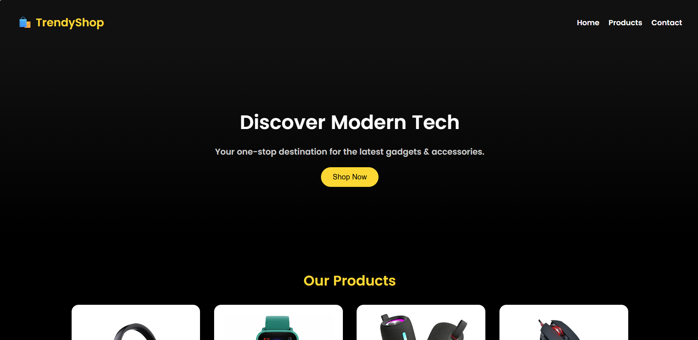
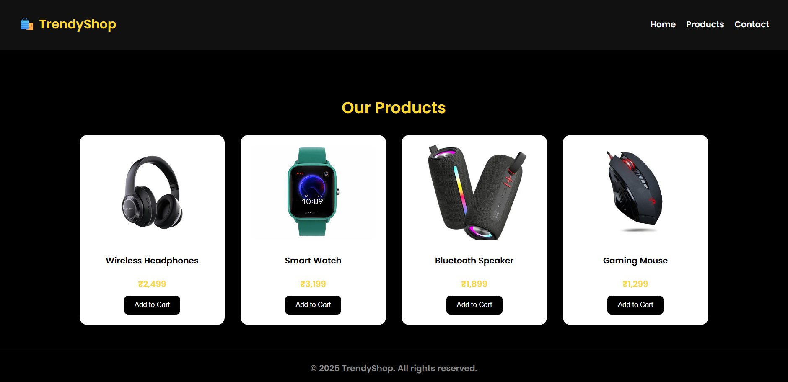

# ProductCatalogUsingReact-JS
Product catalog like Product name, Product ID, Product  Price and Product Image using React-JS 

---

## Project Preview




---

### Installation

1. Clone the repository:
```

git clone https://github.com/Mahadevaprasad17/ProductCatalogUsingReact-JS.git

```
2. Navigate to the project directory:
```

cd ProductCatalogUsingReact-JS

```
3. Install the dependencies:
```

npm install

```
4. Start the development server:
```

npm start

```
5. Open your browser and go to:
```

http://localhost:3000

```
